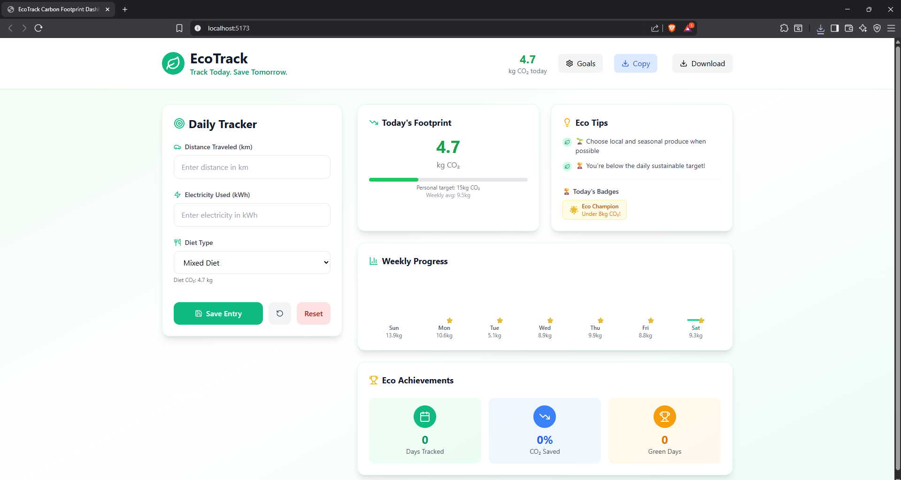

# EcoTrack 🌱

EcoTrack is an interactive daily carbon footprint tracker designed for the Green Spark Hackathon 2025. It helps users monitor and reduce their daily CO₂ emissions by tracking travel distance, electricity usage, and diet type with an easy-to-use and visually appealing interface built using React and TailwindCSS.

---

## Problem Statement

With climate change becoming an urgent global issue, individuals often struggle to understand and manage their personal carbon footprint. EcoTrack aims to empower users by providing a simple tool to track daily activities that contribute to CO₂ emissions, raising awareness and encouraging sustainable lifestyle choices.

---

## Features

- Track daily distance traveled (km) and electricity usage (kWh)
- Select diet type to estimate related carbon emissions
- View daily CO₂ footprint with personal target and weekly averages
- Earn badges and receive eco tips to motivate greener habits
- Responsive UI built with React and TailwindCSS for smooth user experience

---

## Tech Stack

- React.js  
- TailwindCSS  
- Vite (build tool)  
- JavaScript/TypeScript

---

## Screenshots




**EcoTrack Dashboard Overview:**  
- **Daily Tracker:** Input daily travel distance (km), electricity usage (kWh), and select diet type to estimate daily carbon footprint.  
- **Today's Footprint:** Displays total CO₂ emissions for the day with a progress bar showing personal target and weekly average.  
- **Eco Tips:** Offers actionable eco-friendly suggestions and shows earned badges to encourage sustainable habits.  
- **Weekly Progress:** Visualizes daily carbon footprint trends throughout the week to track improvements.  
- **Eco Achievements:** Tracks total days logged, percentage of CO₂ saved, and number of green days to motivate ongoing eco-conscious behavior.


## Team Information

- Member 1: Bazil Muhammad B
- Member 2: Azhar shiju
- Member 3: Haripriya I H
- Member 4: Aliya Mumthas A L


- GitHub: [Your GitHub Profile URL]  
- Email: bazilrepo@gmail.com

---

## Future Plans

- Integrate with real-time carbon emission APIs to provide accurate and dynamic footprint calculations based on location and activity.
- Implement personalized recommendations and actionable tips using AI to help users reduce their footprint effectively.
- Add multi-language support to increase accessibility and global impact.
- Develop a mobile app with offline mode for convenient tracking anytime, anywhere.
- Introduce social features like community challenges, leaderboards, and sharing to foster collective environmental action.
- Expand tracking categories to include water usage, waste management, and sustainable shopping habits.
- Collaborate with environmental organizations for verified badges and rewards to incentivize eco-friendly behavior.

---

## How to Run Locally

1. Clone the repository  
   ```bash
   git clone https://github.com/your-username/eco-track.git 
